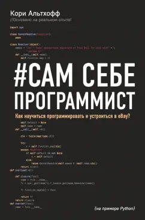

# althoffbooklearn
self-taught book for programmers by Cory Althoff

# althoffbooklearn




---

## Описание проекта / Project description

### :

Здесь находятся мои файлы, упражнения, заметки и небольшие проекты, которые я делаю в процессе изучения книги Кори Альтхоффа «Сам себе программист. Как научиться программировать и устроиться в eBay?» / *The Self-Taught Programmer: The Definitive Guide to Programming Professionally*.

Данный репозиторий я сделал для своего личного обучения, но решил оставить его в public версии. Возможно, кому-то еще будет удобно смотреть мои решения, сравнивать подходы или просто проходить книгу параллельно со мной.

Важно: файлы в этом репозитории являются моими собственными учебными материалами и не являются официальными ответами к книге. Где-то код может быть простым, где-то неидеальным, где-то экспериментальным. Я сам учусь, поэтому любые советы, замечания и подсказки будут полезны.

В случае каких-либо вопросов, замечаний или предложений пишите мне в личные сообщения. Буду рад обратной связи и конструктивным советам.

---

### :

This repository contains my files, exercises, notes, and small projects created while studying Cory Althoff's book *The Self-Taught Programmer: The Definitive Guide to Programming Professionally*.

I created this repository for my personal learning, but decided to keep it public. Maybe it will also be useful for someone who is going through the same book, comparing solutions, or learning programming from scratch.

Important: the files in this repository are my own study materials and should not be treated as official answers to the book. Some code may be simple, imperfect, or experimental. I am still learning, so any advice, comments, or suggestions are very welcome.

If you have any questions, comments, or suggestions, feel free to DM me. I will be glad to receive feedback.

---

## Структура репозитория / Repository Structure

### :

Репозиторий будет постепенно наполняться по мере прохождения книги. Чтобы не складывать все файлы в одну папку, материалы можно разбить по основным частям книги: Python, объектно-ориентированное программирование, инструменты программиста, основы computer science и профессиональная практика.

Файлы и папки могут изменяться по мере того, как я буду проходить книгу, переписывать старые решения и добавлять новые упражнения.

---

### :

This repository will be gradually updated as I continue studying the book. To keep everything organized, the materials may be divided into the main parts of the book: Python, object-oriented programming, programmer tools, computer science fundamentals, and professional programming practice.

Files and folders may change as I move through the book, rewrite older solutions, and add new exercises.

---

## Содержимое / Contents

| Folder | Тема (RU) | Topic (EN) |
|--------|-----------|------------|
| `part_01_python_basics` | Основы Python 3 и первые программы | Python 3 basics and first programs |
| `part_02_oop` | Объектно-ориентированное программирование | Object-oriented programming |
| `part_03_programmer_tools` | Bash, Git, регулярные выражения, web scraping | Bash, Git, regular expressions, web scraping |
| `part_04_computer_science` | Структуры данных и алгоритмы | Data structures and algorithms |
| `part_05_professional_practice` | Best practices, командная работа и поиск первой работы | Best practices, teamwork, and job search |
| `mini_projects` | Небольшие учебные проекты | Small learning projects |
| `notes` | Личные заметки по книге | Personal book notes |
| `experiments` | Эксперименты с кодом | Code experiments |

---

## Как запускать файлы / How to run files

### :

Большинство файлов в репозитории предполагается запускать через Python 3.

Пример:

```bash
python3 filename.py
